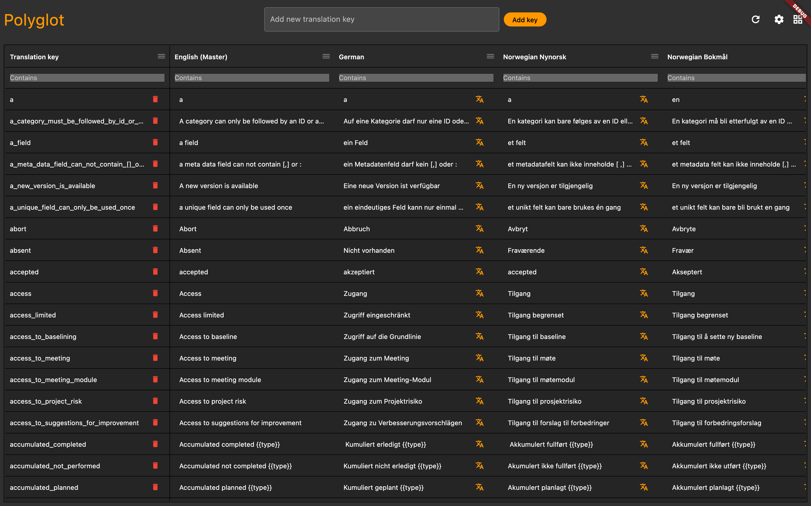

# Polyglot
A program for Mac, Windows and Linux to manage multiple translation files at once. Easy to use UI, multithreaded for optimization and Google Translate 
natively integrated.

## How to install
At the moment the program has only be tested on Mac and Windows, but Linux will be tested and supported soon. The latest release
can be downloaded from [here](https://github.com/Jesperpaulsen/polyglot/releases).

## How to use
In the folder you have your translation files, create a file called `polyglot.json`. In Polyglot, select the Icon at the top right
and select **Open new**, and select your files. To populate the data needed for Polyglot to operate, go to settings. Settings can be opened by clicking `cmd/ctrl + ,`. If you use a root key in
your translation files, add it in the input field called "translation key". Select the tab **translation settings**, and add your languages. After adding the
languages, you will see that the `polyglot.json` file has been populated with data about your translation setup. If you need to
change the path to a language file, you can do that in this file.

### Examples
Examples with and without root a root translation key can be found [here](examples) 

### Add new translation
Adding a new translation can be done by using the input field above the grid or by clicking `cmd/ctrl + n`.

### Google Translate API
In order to use the Google Translate API, you need a Google Translate API key. After activating the Google Translate module, you can obtain an API key by going to **APIs & Services** in the
Google Cloud Console. Click **Credentials** and **Create Credentials**. Create a key that only has access to the Google Translate APIs. Be aware that batch translating large documents can be costly.

#### Master language
Polyglot uses a master language to translate the other languages. The first language you choose will automatically be used as the master language,
but this can be changed in the `polyglot.json` file.

#### Single text translation
By using the Translation button in the grid or when adding a new key, the field will be automatically translated based on the master translation.

#### Batch translation (Beta)
The batch translation is currently in Beta. Due to limitations on the Google Translate API, this feature is a bit unstable,
but will hopefully be more stable in the future.
